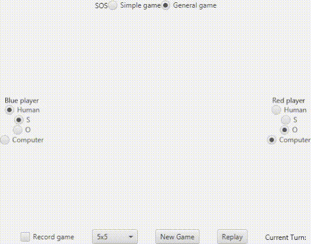
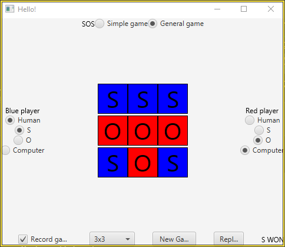

# SOSGame
An app to play SOS, a game similar to Tic-tac-toe.

Created using Java, JavaFX, JUnit
# Features
* Two game modes: 'simple' ends after tiles make an 'SOS', while 'general' continues until the board has no empty tiles left.
* Customizable board size.
* Play against AI.
* Unit tests check that all features work properly, over a variety of board sizes and game modes.

